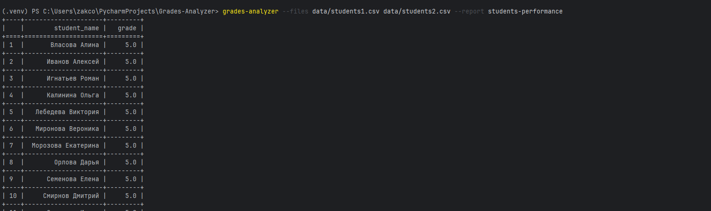
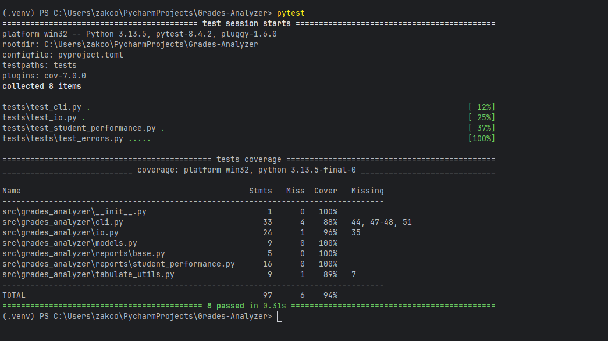

# grades-analyzer

CLI-скрипт для генерации отчётов об успеваемости студентов из CSV-файлов.

# Формат CSV

student_name,subject,teacher_name,date,grade
Семенова Елена,Английский язык,Ковалева Анна,2023-10-10,5

# Запуск с указанием путей к файлу
python -m grades_analyzer.cli --files "Укажите путь к файлу\students1.csv" --report students-performance

# Запуск через установленный CLI
grades-analyzer --files data/students1.csv data/students2.csv --report students-performance

# Пример запуска

# Архитектура
- `reports.BaseReport` — протокол отчёта.
- `reports.StudentPerformanceReport` — отчёт «успеваемость студентов».
- Добавить новый отчёт: создать класс-реализатор в `grades_analyzer/reports/` и зарегистрировать в `REPORTS_REGISTRY` в `cli.py`.

# Разработка
- Зависимости для разработки: `pytest`, `pytest-cov`, `ruff` (опционально).
- Запуск тестов:

# Запуск тестов
Для запуска тестов с покрытием выполните:
pytest
pytest -q --disable-warnings --maxfail=1 --cov=grades_analyzer

# Результат тестов

